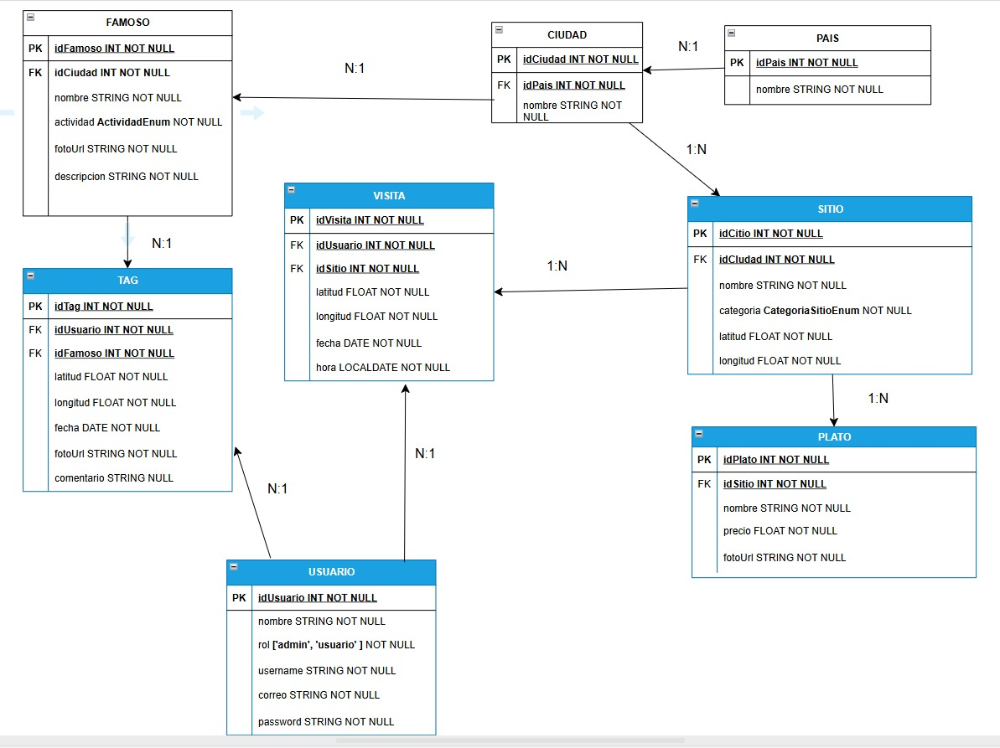

# Tourism Discovery App

A tourism platform for travelers to discover, explore, and share experiences in Colombia, Costa Rica, and Guatemala. Provides guidance for tourists in new cities through community-driven content and visit tracking.



## Architecture

Monolithic architecture with separated frontend and backend services:

### Backend

- **Technology Stack**: Node.js, Express.js, MongoDB Atlas, Mongoose
- **Location**: `/Backend/`
- **Purpose**: RESTful API providing data management for countries, cities, tourist sites, dishes, famous people, users, tags, and visits

### Frontend

- **Technology Stack**: Ionic, Angular, Capacitor
- **Location**: `/Frontend/`
- **Purpose**: Mobile application with cross-platform capabilities for iOS and Android

## Features

- User authentication with role-based access
- Tourist site discovery by country
- Visit tracking with geolocation
- Celebrity tagging with photos and QR codes
- Favorite sites and custom routes (local storage)
- Statistics and site management

## Project Structure

```
App-Posts/
├── Backend/              # REST API Server
│   ├── models/          # Database schemas
│   ├── routes/          # API endpoints
│   ├── index.js         # Server entry point
│   ├── seed.js          # Database seeding
│   └── package.json     # Backend dependencies
├── Frontend/            # Mobile Application
│   └── [Ionic/Angular files]
├── docs/                # Documentation
│   ├── dbmodel.jpg      # Database model diagram
│   └── requirements.md  # Project specifications
└── README.md           # This file
```

## Getting Started

### Prerequisites

- Node.js 14+
- MongoDB Atlas account
- Ionic CLI

### Setup Instructions

#### 1. Backend Setup

```bash
cd Backend
npm install
```

Create a `.env` file in the Backend directory:

```
MONGO_ATLAS_URI=mongodb+srv://your-connection-string
PORT=8080
NODE_ENV=development
JWT_SECRET_KEY=your-very-secret-key
```

_If it is the FIRST TIME USING the API_
Seed the database and start the server:

```bash
npm run seed
```

#### 2. Frontend Setup

```bash
cd Frontend
npm install
ionic serve
```

### Running the Applications

Both backend and frontend must be running simultaneously:

1. **Start Backend** (Terminal 1):

   ```bash
   cd Backend
   npm run dev
   ```

2. **Start Frontend** (Terminal 2):
   ```bash
   cd Frontend
   ionic serve
   ```

## Data Model

The application manages data for three countries (Colombia, Costa Rica, Guatemala) with:

- 30 cities (10 per country)
- 30 tourist sites (10 per country)
- Traditional dishes by location
- Famous personalities by country
- User-generated content (visits and tags)

## API Documentation

- The backend exposes a RESTful API for all core entities (countries, cities, sites, dishes, famous people, users, tags, visits).
- **Advanced queries**: Includes endpoints for statistics and discovery, such as:
  - Most tagged famous people
  - Users with most visits
  - Dishes by location (country/city)
  - Dishes tagged/visited by unique users
  - **Top 10 most visited sites (global, no country filter)**
- All endpoints and example responses are documented in [Backend/README.md](Backend/README.md) and [Backend/docs/ejemplos-queries.md](Backend/docs/ejemplos-queries.md).

## Contributors

This project was developed in collaboration with [Diego Santacruz](https://github.com/stzdiego) for the Mobile Development course 2025-01.

## License

Educational project developed for university coursework.

## Environment Variables

The following environment variables are required for the backend (set in `.env` or `Backend/.env`):

```
NODE_ENV=development         # Environment (development/production)
PORT=8080                   # Port for backend server
MONGO_ATLAS_URI=...         # MongoDB Atlas connection string
JWT_SECRET_KEY=...          # Secret key for JWT authentication
CLOUDINARY_CLOUD_NAME=...   # Cloudinary cloud name (for image uploads)
CLOUDINARY_API_KEY=...      # Cloudinary API key
CLOUDINARY_API_SECRET=...   # Cloudinary API secret
```

> Example values are provided in the `.env` files. Never commit real credentials to public repositories.
